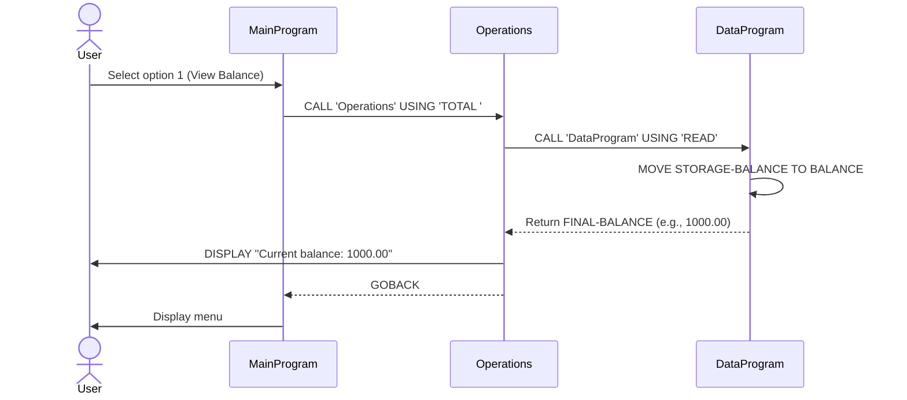
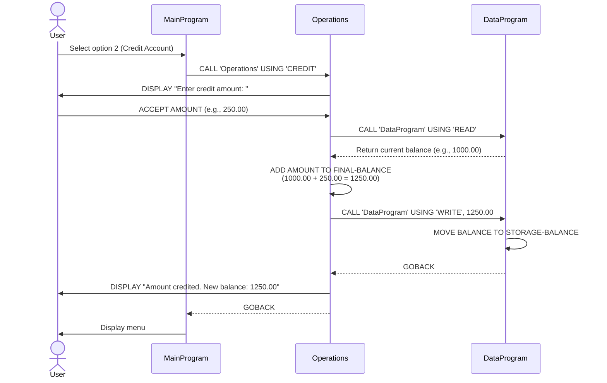
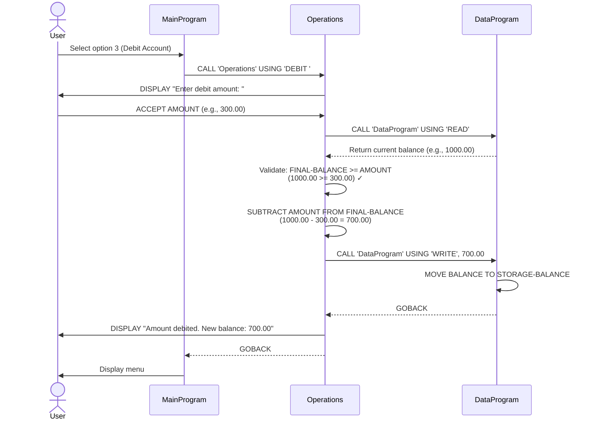
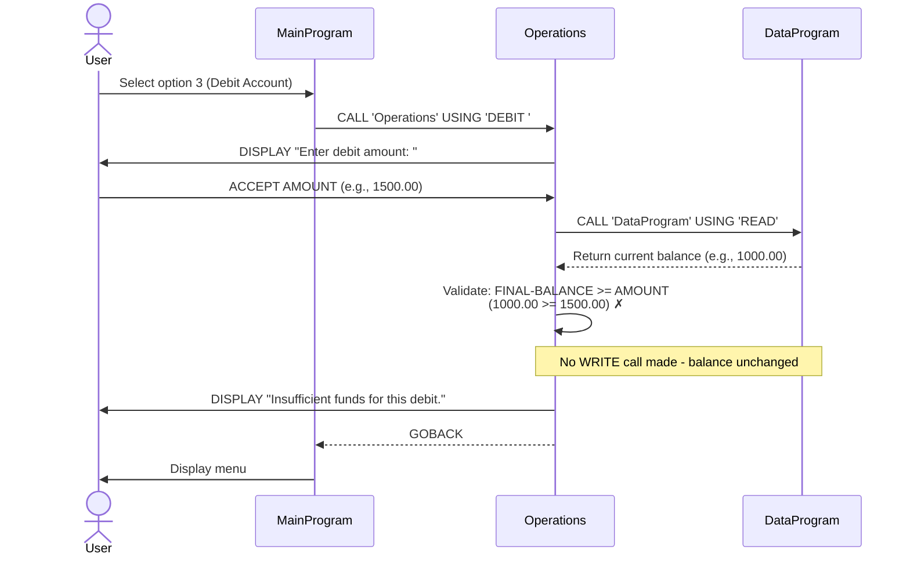
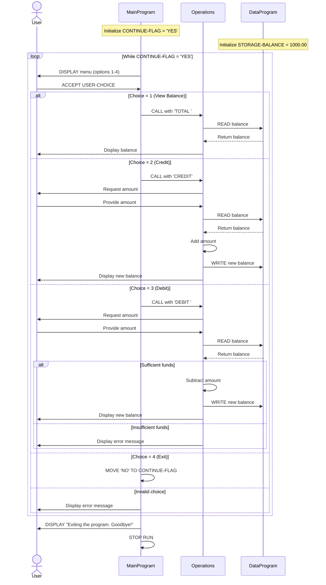

# COBOL Account Management System Documentation

## Overview

This legacy COBOL system implements a simple account management application for student accounts. The system provides basic banking operations including balance inquiry, credit (deposit), and debit (withdrawal) functionality.

## System Architecture

The application follows a modular design with three main COBOL programs:

```
┌─────────────┐
│ MainProgram │ (Entry Point)
└──────┬──────┘
       │
       ├─> Calls
       │
┌──────▼────────┐
│  Operations   │ (Business Logic)
└──────┬────────┘
       │
       ├─> Calls
       │
┌──────▼────────┐
│ DataProgram   │ (Data Persistence)
└───────────────┘
```

---

## COBOL Files Documentation

### 1. main.cob (MainProgram)

**Purpose:**  
Entry point of the application that provides a user-interactive menu system for account management operations.

**Key Functions:**
- **Menu Display**: Presents a text-based menu with four options:
  1. View Balance
  2. Credit Account
  3. Debit Account
  4. Exit
- **User Input Handling**: Accepts user choice (1-4) and routes to appropriate operations
- **Program Flow Control**: Uses a loop that continues until user selects exit option
- **Input Validation**: Displays error message for invalid menu selections

**Technical Details:**
- **Data Fields:**
  - `USER-CHOICE`: Stores menu selection (PIC 9)
  - `CONTINUE-FLAG`: Controls program loop ('YES'/'NO')
- **Control Logic:** Uses EVALUATE statement for menu choice routing
- **External Calls:** Invokes 'Operations' program with operation type parameter

---

### 2. operations.cob (Operations)

**Purpose:**  
Implements the core business logic for all account operations including balance inquiry, credits, and debits.

**Key Functions:**

#### View Balance (TOTAL)
- Retrieves current balance from DataProgram
- Displays balance to user

#### Credit Account (CREDIT)
- Prompts user for credit amount
- Retrieves current balance
- Adds credit amount to balance
- Updates balance in DataProgram
- Displays new balance

#### Debit Account (DEBIT)
- Prompts user for debit amount
- Retrieves current balance
- **Business Rule**: Validates sufficient funds before processing
- Subtracts debit amount from balance if funds are sufficient
- Updates balance in DataProgram
- Displays appropriate message (success or insufficient funds)

**Technical Details:**
- **Data Fields:**
  - `OPERATION-TYPE`: Type of operation requested (PIC X(6))
  - `AMOUNT`: Transaction amount (PIC 9(6)V99 - up to $9,999.99)
  - `FINAL-BALANCE`: Working balance variable (PIC 9(6)V99)
- **External Calls:** Communicates with DataProgram using 'READ' and 'WRITE' operations
- **Input/Output:** Uses ACCEPT for user input and DISPLAY for output

---

### 3. data.cob (DataProgram)

**Purpose:**  
Manages data persistence by maintaining the account balance in memory. Acts as a simple data storage layer.

**Key Functions:**

#### Read Operation
- Returns current balance to calling program
- Operation Type: 'READ'

#### Write Operation
- Updates stored balance with new value from calling program
- Operation Type: 'WRITE'

**Technical Details:**
- **Data Fields:**
  - `STORAGE-BALANCE`: Persistent balance storage (PIC 9(6)V99, Initial: $1,000.00)
  - `OPERATION-TYPE`: Determines read or write operation (PIC X(6))
- **Linkage Section:**
  - `PASSED-OPERATION`: Operation type from caller
  - `BALANCE`: Balance value passed between programs

---

## Business Rules - Student Accounts

### 1. Initial Balance
- **Rule**: All student accounts start with an initial balance of $1,000.00
- **Implementation**: Default value in `STORAGE-BALANCE` (data.cob)

### 2. Balance Limits
- **Maximum Balance**: $999,999.99 (based on PIC 9(6)V99 format)
- **Minimum Balance**: $0.00 (enforced by insufficient funds check)

### 3. Transaction Rules

#### Credits (Deposits)
- **Maximum Single Transaction**: $999,999.99
- **No validation on minimum credit amount**
- **Immediate posting**: Balance updated immediately after credit

#### Debits (Withdrawals)
- **Maximum Single Transaction**: $999,999.99
- **Insufficient Funds Check**: 
  - Debit is **rejected** if amount exceeds current balance
  - Error message displayed: "Insufficient funds for this debit."
  - Balance remains unchanged on rejection
- **Immediate posting**: Balance updated immediately after successful debit

### 4. Data Persistence
- **Session-Based**: Balance persists only during program execution
- **No File Storage**: Current implementation uses in-memory storage only
- **Reset on Restart**: Balance resets to $1,000.00 when program restarts

### 5. Precision and Currency
- **Decimal Places**: 2 decimal places (cents)
- **Currency Format**: Numeric only (no currency symbol in storage)
- **Rounding**: Standard COBOL decimal handling

---

## Program Flow Example

### Successful Debit Transaction:
```
1. User selects option 3 (Debit Account) in main.cob
2. main.cob calls Operations with 'DEBIT' parameter
3. Operations prompts user for amount (e.g., $50.00)
4. Operations calls DataProgram with 'READ' to get current balance
5. Operations validates: balance ($1,000.00) >= amount ($50.00) ✓
6. Operations calculates new balance ($950.00)
7. Operations calls DataProgram with 'WRITE' to update balance
8. Operations displays: "Amount debited. New balance: 950.00"
9. Control returns to main menu
```

### Failed Debit Transaction (Insufficient Funds):
```
1. User selects option 3 (Debit Account)
2. Operations prompts for amount (e.g., $1,500.00)
3. Operations reads balance ($1,000.00)
4. Operations validates: balance ($1,000.00) >= amount ($1,500.00) ✗
5. Operations displays: "Insufficient funds for this debit."
6. Balance remains $1,000.00 (no update call made)
7. Control returns to main menu
```

---

## Future Modernization Considerations

When modernizing this legacy code, consider:

1. **Data Persistence**: Implement database or file storage for permanent record keeping
2. **Transaction History**: Add audit trail for all account activities
3. **Multi-Account Support**: Extend to handle multiple student accounts
4. **Enhanced Validation**: Add input validation for amount fields (negative numbers, overflow)
5. **Overdraft Protection**: Implement configurable overdraft limits for student accounts
6. **Security**: Add authentication and authorization mechanisms
7. **Reporting**: Generate account statements and transaction reports

---

## Technical Notes

- **COBOL Version**: Standard COBOL-85 compatible
- **Numeric Format**: PIC 9(6)V99 allows up to 6 digits before decimal, 2 after
- **Program Calls**: Uses CALL/USING mechanism for inter-program communication
- **Return Mechanism**: Programs use GOBACK to return control to caller

---

## Sequence Diagrams - Application Data Flow

### 1. View Balance Operation



### 2. Credit Account Operation



### 3. Debit Account Operation (Successful)



### 4. Debit Account Operation (Insufficient Funds)



### 5. Complete Application Flow


